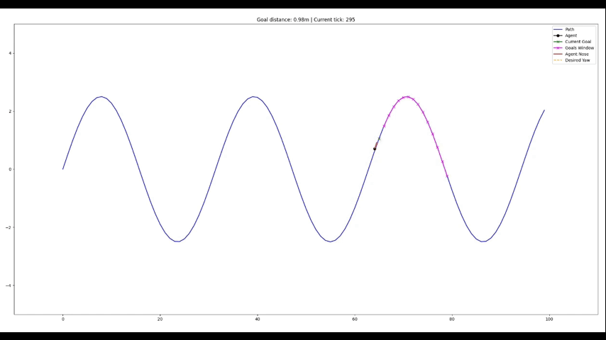

## Path Following Reinforcement Learning

This repository contains code for training a reinforcement learning agent to follow a path using the DDPG algorithm. The agent is trained in a 2D environment where it learns to navigate along a predefined path. The repository was created to be easy to change the model and reward functions.



## Project Structure

```
path_following_rl/
├── agent/                  # DDPG agent implementation
│   ├── ddpg.py            # DDPG algorithm
│   └── models.py          # Neural network architectures
├── environment/           # Environment implementation
│   └── simple.py          # Simple path following environment
├── models/                # Saved model weights
├── scripts/               # Testing and utility scripts
│   ├── test.py           # Model evaluation script
│   └── teleop_keyboard.py # Manual control for testing
├── utils/                 # Utility functions
├── requirements.txt       # Python dependencies
├── train.py              # Main training script
└── install.sh            # Installation script
```

## Installation

To install the required dependencies, run the following command:

```bash
./install.sh
```

## Usage
To train the agent, use the following command:

```bash
python train.py
```

The runs files will be saved in the `runs` directory with the timestamp of the training session. You can monitor the training progress using TensorBoard:

```bash
tensorboard --logdir runs
```
You can then open your web browser and navigate to `http://localhost:6006` to view the training metrics.

To evaluate the trained agent, use the following command:

```bash
python scripts/test.py
```

## Environment

This project includes a custom environment for path following, implemented in the `environment/simple.py` file. The environment is designed to be compatible with OpenAI Gym, allowing for easy integration with reinforcement learning libraries.

The environment simulates a 2D path following task where:
- **Agent**: Represented as a point with position (x, y) and orientation (θ).
- **Path**: Generated with various shapes (straight lines, curves, etc.) with randomized parameters.
- **Goal Window**: Agent observes next 15 subgoals along the path.
- **Rewards**: Based on distance to path, progress along path, and goal completion.
- **Episode Termination**: When agent reaches the end of path or exceeds maximum steps (800).

There are defined a few paths shapes and with randomized parameters. Every time the environment is reset, a new path is generated.

## Know Issues

- CPU running, may cause some issues;
- Even the agent distance to the goal is under threshold distance isn't considered as success. I don't know yet why. Maybe related to CPU running.

## Future work

- [ ] Environment with more paths;
- [ ] Start the agent in a random position;
- [ ] Add obstacles to the environment;
- [ ] ROS2 implementation;
- [ ] Environment on Isaac Sim;
- [x] Script to install dependencies;
- [ ] Release a pre trained model.

## Cite

If you use this code in your research, please cite the repository as follows:

```bibtex
@misc{path_following_rl,
  author = {Jardel Dyonisio},
  title = {Path Following Reinforcement Learning},
  year = {2025},
  url = {https://github.com/jardeldyonisio/path_following_rl}
}
```